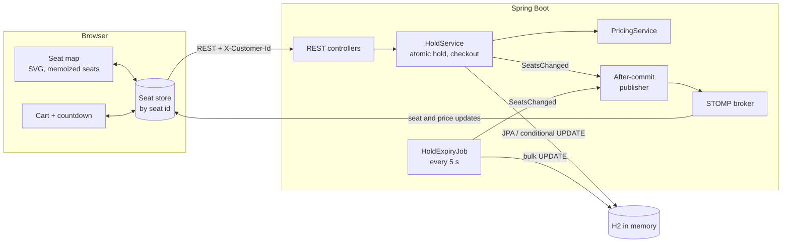

# Architecture

## System overview



1. The browser subscribes to `/topic/venue`, then loads the venue snapshot over REST.
2. A click sends a hold request. `HoldService` holds the seats with one conditional `UPDATE`, all or nothing.
3. Only after the transaction commits does the publisher send small per-seat updates, plus new section prices, to every open map.
4. `HoldExpiryJob` releases expired holds every 5 seconds and publishes them the same way.
5. Checkout locks the customer's seats, checks the holds, marks them sold, and creates an order.

## Repository layout

```
theater-arena-booking/
├── CLAUDE.md             router and the single register of repo values
├── CHANGELOG.md          one changelog for both apps
├── .claude/              hooks, skills, reviewer agents
├── scripts/              CI helper (check-added-comments.cjs)
├── backend/              Spring Boot app (Maven wrapper)
└── frontend/             Vite + React + TypeScript app
```

## Backend

- **Package root:** `com.arena`, one top-level package per feature: `venue`, `hold`, `pricing`, `order`, `ws`.
- **Layers:** controller → service → repository → entity, with `dto` records and an `exception` package. Controllers hold no business logic and never return entities.
- **Pricing:** `PricingService` is the only place a price is computed. See [Dynamic Pricing](Dynamic-Pricing.md).
- **Holds:** `HoldService` owns the atomic hold, release, and checkout. See [Seat Holds and Concurrency](Seat-Holds-and-Concurrency.md) and [Hold Expiry and Checkout](Hold-Expiry-and-Checkout.md).
- **Time:** an injected `Clock`, so tests can move time instead of sleeping.
- **Publishing:** services raise an application event; a `@TransactionalEventListener(phase = AFTER_COMMIT)` sends it to `/topic/venue`. See [Real-Time Updates](Real-Time-Updates.md).
- **Errors:** one `@RestControllerAdvice` returns `{code, message}` with 400, 404, 409, or 410. See [API Reference](API-Reference.md).
- **Schema:** Flyway migrations only, with `ddl-auto: validate`.

## Frontend

- **API client:** `src/api/client.ts` is the only code that calls `fetch`. It attaches `X-Customer-Id` and turns `{code, message}` errors into typed errors.
- **Store:** one zustand store with seats normalized by id, patched by socket updates using the `seq` rule.
- **Seat map:** one SVG with memoized seats, delegated pointer events, and one shared tooltip.
- **Socket:** one hook owns the STOMP connection, buffering, and resync.
- See [Frontend Design](Frontend-Design.md) for details.
