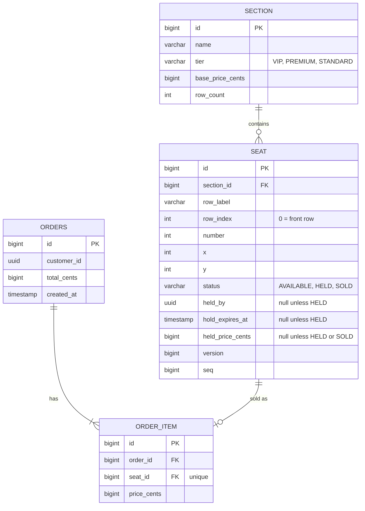

# Data Model

> Created by Flyway migrations in `backend/src/main/resources/db/migration`. `ddl-auto` is `validate`, so the entities must match the migrations exactly. Built in issue [#2](https://github.com/amalps565/theater-arena-booking/issues/2) (venue) and [#4](https://github.com/amalps565/theater-arena-booking/issues/4) (orders).

## Rules

- **Money** is always a `bigint` of cents, never a decimal or float.
- **Status** is stored as a string (`@Enumerated(EnumType.STRING)`).
- A `HELD` seat always has `held_by`, `hold_expires_at`, and `held_price_cents`. An `AVAILABLE` seat has all three null.
- A `HELD` seat whose `hold_expires_at` is in the past counts as **free** in every availability check. See [Hold Expiry and Checkout](Hold-Expiry-and-Checkout.md).
- `version` is incremented by every update. It's a second line of defence (`@Version`) for any write made through a JPA entity.
- `seq` is incremented on every status change of a seat and travels in every update, so clients can drop stale messages. See [Real-Time Updates](Real-Time-Updates.md).
- `order_item.seat_id` is unique, so a seat can never be sold twice even if a code path were wrong.

## Indexes

| Index | Used by |
|---|---|
| `seat(section_id)` | Venue snapshot, section fill level for pricing |
| `seat(status, hold_expires_at)` | The expiry job's bulk release |
| `seat(held_by)` | `GET /api/holds/me` and checkout |

## Seed data

A startup seeder creates about six sections in three tiers, each with 40 rows of 50 seats: roughly **12,000 seats**. That's enough to prove the seat map stays fast. Seat `x`/`y` positions lay the sections out around a stage.
