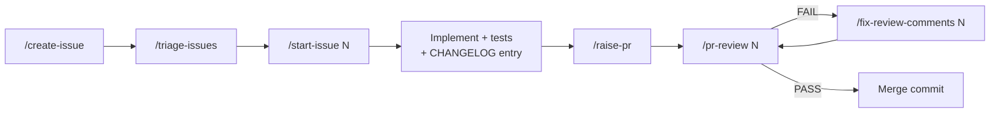

# Development Workflow

> `CLAUDE.md` is the single register of the repo's values: branches, gate commands, version bump, merge method. This page explains the flow; if the two disagree, `CLAUDE.md` wins.

## Issue to merge

| Step | Skill | What it does |
|---|---|---|
| File | `/create-issue` | Drafts a plain-English user story with acceptance criteria, checks for duplicates, and creates it after you confirm |
| Pick | `/triage-issues` | Reads the open backlog and recent merges, then recommends the next issue. Changes nothing |
| Start | `/start-issue <N>` | Reads the issue and comments, loads only the matching conventions skill, assigns you, and creates the branch |
| Open PR | `/raise-pr` | Runs the gate commands, checks the version bump and commits, then opens the PR with `Closes #N` |
| Review | `/pr-review <N>` | Reviews the diff with the reviewer agent(s) and posts one PASS or FAIL verdict with a findings table |
| Fix | `/fix-review-comments <N>` | Verifies each finding, agrees fixes with you, commits, and replies |

## CI

`.github/workflows/ci.yml` (modelled on the Lambdabooks CI) runs on every pull request to `main` and every push to `main`, as three jobs. Each step after the first carries `if: !cancelled()`, so one failure does not hide the others.

| Job | Steps |
|---|---|
| Quality (versions, PR title, comments, hooks, secrets) | `scripts/validate-versions.cjs`: `pom.xml`, `package.json` and `CHANGELOG.md` agree, and on a PR the version moves from the base by exactly one +1 increment. PR title matches `#<N> \| <description>` (10–100 chars). `scripts/check-added-comments.cjs` against the PR base. All hook tests (`.claude/hooks/tests/run-all.cjs`). A gitleaks secret scan with `.gitleaks.toml`. |
| Backend (format + tests) | `./mvnw spotless:check`, then `./mvnw test` |
| Frontend (lint + tests + build) | `npm ci`, `npm run lint`, `npm test -- --run`, `npm run build`, then the react-lint hook suite against the installed ESLint |

Both apps are checked on every PR, even one that only touches one side, so a contract break between them is caught. Maven and npm downloads are cached, and Node comes from `frontend/.nvmrc`. Merge only when all three jobs are green.

## Branches and PRs

- Branch from an up-to-date `main`, named `<N>-short-slug`, for example `3-atomic-seat-holds`.
- Never commit to `main` or `master`; a hook blocks it.
- PR title: `#<N> | <short description>`. Body: `Closes #N`.
- Merge with a **merge commit** (`gh pr merge <N> --merge`), never squash. The PR's `Closes #N` closes the issue.
- Keep a branch in sync by merging `main` into it, never by rebasing.

## Labels and routing

| Label | Conventions skill | Reviewer agent |
|---|---|---|
| `backend` (or any change under `backend/`) | `java-conventions` | `senior-java-engineer` |
| `frontend` (or any change under `frontend/`) | `react-conventions` | `senior-react-engineer` |

Type labels: `bug` for the three flaws, `enhancement` for features.

## Changelog and versions

- One root `CHANGELOG.md` for the whole repo.
- Each PR adds one `## [x.y.z] - YYYY-MM-DD` heading, exactly one patch above `main`, with Added, Changed, Fixed, or Removed sections.
- Each entry opens with a bold outcome prefixed `Backend:`, `Frontend:`, `Full stack:`, or `Repo:`, then says what changed and why, and ends with `[#N](…/issues/N)`.
- `backend/pom.xml` `<version>` and `frontend/package.json` `version` must equal the heading.

## Contract changes

The REST contract ([API Reference](API-Reference.md)) and the WebSocket contract ([Real-Time Updates](Real-Time-Updates.md)) are shared by both apps. A PR that changes either one updates the backend, the frontend, and these pages together.

## Database migrations

- Schema changes go only through new Flyway migrations. A merged migration is never edited.
- Two PRs can add the same `V<n>__` number. Check before merging.

## Guardrails (hooks)

Start Claude Code from the **repo root** so `.claude/settings.json` loads.

| Hook | When | Does |
|---|---|---|
| `block-secrets` | Before a write or edit | Blocks API keys, tokens, private keys, and secret assignments |
| `block-comments` | Before a write or edit | Blocks any comment added to Java under `src/{main,test}/java`, TS/JS under `frontend/src`, hooks, scripts, or workflows |
| `block-unsafe-bash` | Before a shell command | Blocks piping downloads into a shell, sending secrets to the network, and similar commands |
| `protect-branches` | Before a shell command | Blocks commits and pushes on `main` and `master` (read from `CLAUDE.md`) |
| `java-lint` | After editing backend Java | Runs `spotless:check` on the file |
| `react-lint` | After editing frontend source | Runs ESLint with `--max-warnings=0` on the file |

## No comments in source

`.claude/conventions/comment-conventions.md` bans every comment in source files, including Javadoc. A reason goes in the changelog entry, a guarantee goes in a test name, and deferred work goes in an issue.
