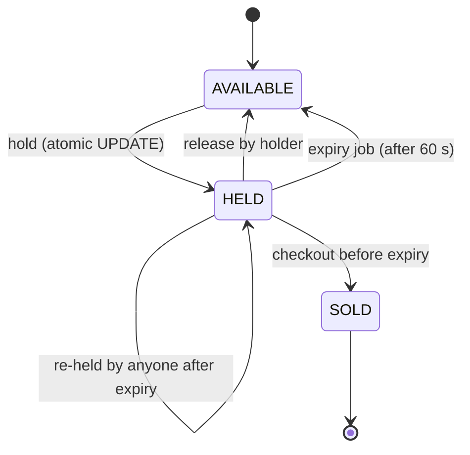

# Hold Expiry and Checkout

How abandoned holds are released, and how a customer buys their held seats. Built in issue [#4](https://github.com/amalps565/theater-arena-booking/issues/4).

## Seat lifecycle

## Three ways a hold ends

| Way | When | How |
|---|---|---|
| **Lazy** | Immediately at `hold_expires_at` | Every availability check treats `HELD` with `hold_expires_at < now` as free. A stale hold never blocks another customer, even if the job is late. |
| **Active** | Within about 5 seconds of expiry | `HoldExpiryJob` runs `@Scheduled(fixedRate = 5000)` and bulk-updates expired holds back to `AVAILABLE`. It then publishes those seats, so every open map shows them free. |
| **Explicit** | Whenever the holder chooses | `DELETE /api/holds/{seatId}` releases the seat at once. |

The lazy rule makes the system **correct**. The job makes the maps **accurate**.

## Checkout

`POST /api/checkout` runs in one transaction:

1. Lock the customer's held seats with `SELECT ... FOR UPDATE`, in ascending id order.
2. If the customer holds no seats, return **400 `NOTHING_TO_CHECK_OUT`**.
3. If any seat is no longer held by the customer, or its `hold_expires_at` has passed, return **410 `HOLD_EXPIRED`**. Nothing is bought.
4. Mark every seat `SOLD`, increment `seq`, and clear `held_by` and `hold_expires_at`.
5. Create an order with one item per seat, each at its frozen `held_price_cents`, and the total.
6. Raise `SeatsChanged`, which is published after commit.

Locking the rows stops the expiry job, or another customer re-holding an expired seat, from changing them halfway through checkout.

## Time

Every "now" comes from an injected `Clock`. Tests use a fixed clock and move it forward 61 seconds instead of sleeping. See [Testing Strategy](Testing-Strategy.md).
