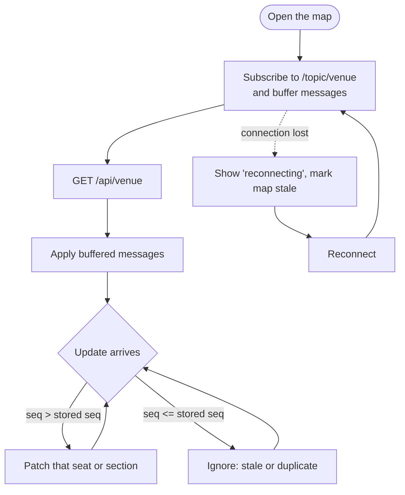

# Real-Time Updates

> STOMP over WebSocket at `/ws`. The backend publishes after each commit, and the frontend store applies the updates. Built in issues [#5](https://github.com/amalps565/theater-arena-booking/issues/5) (server) and [#7](https://github.com/amalps565/theater-arena-booking/issues/7) (client).

## Transport

- **STOMP over WebSocket**, using Spring's WebSocket support on the server and `@stomp/stompjs` in the browser.
- **Endpoint:** `/ws`, plain WebSocket with no SockJS. The Vite dev server proxies it to the backend.
- **Topic:** `/topic/venue`. Clients may only subscribe; `SEND` frames are rejected.
- **Heartbeats** every 10 seconds.

## Messages

**Seat change:** one message per seat that changed.

```json
{ "type": "SEAT", "seatId": 101, "status": "HELD", "seq": 4 }
```

**Section prices:** sent when a section's fill level changes its prices.

```json
{ "type": "PRICES", "sectionId": 1, "seq": 9, "prices": [[101, 22500], [102, 22500]] }
```

- `status` is `AVAILABLE`, `HELD`, or `SOLD`.
- A seat message's `seq` is that seat's `seq` column, which increases on every change.
- A price message's `seq` increases per section.
- Messages never carry who holds a seat. A browser knows its own holds from its hold responses and `GET /api/holds/me`.

## Server rules

- **Publish only after commit**, with `@TransactionalEventListener(phase = AFTER_COMMIT)`. A hold that fails and rolls back is never broadcast.
- **Send only what changed:** the seats that changed, never the whole venue.
- The expiry job and checkout publish through the same listener as holds.

## Client rules



1. **Subscribe first, then load.** Buffer messages until the snapshot arrives, then apply the buffered ones using the `seq` rule. Nothing is lost.
2. **Drop old updates.** Keep the latest `seq` per seat and per section, and ignore any update whose `seq` isn't greater.
3. **Batch.** Collect updates and apply them once per animation frame.
4. **Resync after reconnecting.** Updates sent while disconnected are lost, so reload the snapshot every time the socket reconnects.
5. **Show staleness.** While disconnected, show a clear "reconnecting" badge.
6. **Clean up** the subscription, timers, and animation frames when the page unmounts.
