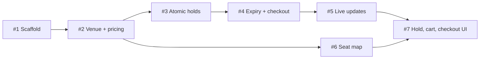

# Roadmap

The seven issues ship in three PRs to save time: #1 alone, #2–#5 together (one commit per issue), and #6–#7 together. Each PR closes every issue it contains and bumps the changelog by one patch.

| # | Issue | Area | Deliverable | Fixes | Depends on | Status |
|---|---|---|---|---|---|---|
| [#1](https://github.com/amalps565/theater-arena-booking/issues/1) | Developers can build, test and run the backend and frontend apps | backend, frontend | Spring Boot app (Web MVC, JPA, Flyway, WebSocket, Validation, H2, Spotless); Vite React TS app (zustand, STOMP, Vitest); dev proxy | | — | ✅ Merged ([PR #8](https://github.com/amalps565/theater-arena-booking/pull/8)) |
| [#2](https://github.com/amalps565/theater-arena-booking/issues/2) | Customers can load the arena with a live price for every seat | backend | Schema, seeder, `PricingService`, `GET /api/venue` | | #1 | ✅ Merged ([PR #9](https://github.com/amalps565/theater-arena-booking/pull/9)) |
| [#3](https://github.com/amalps565/theater-arena-booking/issues/3) | Two customers can no longer hold the same seat at the same time | backend | Atomic hold, release, `GET /api/holds/me`, **concurrency test** | Flaw 1 | #2 | ✅ Merged ([PR #9](https://github.com/amalps565/theater-arena-booking/pull/9)) |
| [#4](https://github.com/amalps565/theater-arena-booking/issues/4) | Abandoned seat holds expire after 60 seconds and held seats can be bought | backend | Expiry job, checkout, orders | Flaw 3 | #3 | ✅ Merged ([PR #9](https://github.com/amalps565/theater-arena-booking/pull/9)) |
| [#5](https://github.com/amalps565/theater-arena-booking/issues/5) | Open seat maps receive seat and price changes as they happen | backend | STOMP config, after-commit publisher | | #3, #4 | ✅ Merged ([PR #9](https://github.com/amalps565/theater-arena-booking/pull/9)) |
| [#6](https://github.com/amalps565/theater-arena-booking/issues/6) | The seat map stays responsive while showing and hovering thousands of seats | frontend | SVG seat map, store, tooltip, zoom and pan | Flaw 2 | #2 | ✅ Built in PR 3 |
| [#7](https://github.com/amalps565/theater-arena-booking/issues/7) | Customers can hold seats, watch the countdown and check out from the seat map | frontend | Hold on click, cart with countdown, checkout, socket hook | | #3–#6 | ✅ Built in PR 3 |

## Order

After #2, the backend chain (#3 → #4 → #5) and the seat map (#6) can run in parallel. #7 joins them.

## Done before the issues

| Done | Item |
|---|---|
| ✅ | Claude Code harness in `.claude/` (hooks, skills, reviewer agents), adapted from Lambdabooks |
| ✅ | `CLAUDE.md` register of repo values; `java-conventions` and `react-conventions` skills |
| ✅ | Root `CHANGELOG.md` at `0.0.1`, `.gitignore` |
| ✅ | GitHub repo, `backend` and `frontend` labels, issues #1–#7 |
