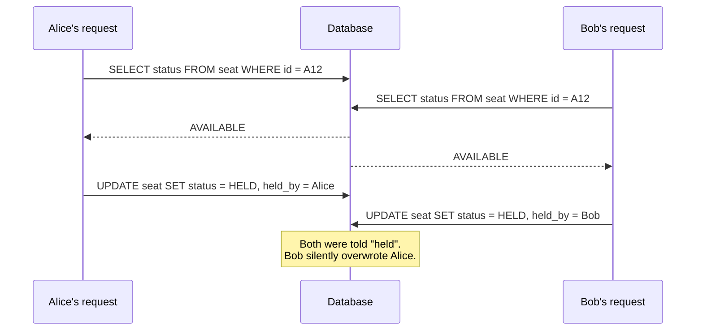
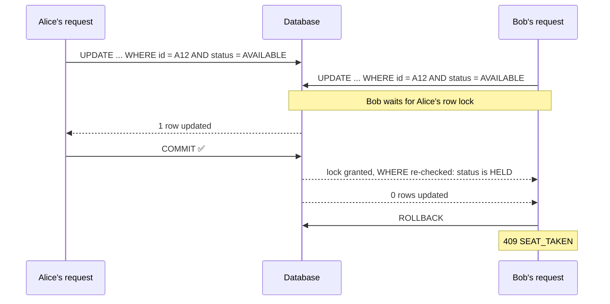

# Seat Holds and Concurrency

This page explains the double-booking race and the fix. Built in issue [#3](https://github.com/amalps565/theater-arena-booking/issues/3).

## The race (read, then write)

Alice and Bob click seat **A12** at the same moment. Each request reads the seat, sees `AVAILABLE`, and writes `HELD`.



### Why the obvious fixes don't work

- **`synchronized` or another in-memory lock:** it only works inside one JVM. A second server instance races just the same.
- **Checking the status in Java and then saving:** this is the race itself. Another request can change the row between the read and the write.
- **`@Version` alone:** it catches the overwrite, but only if every path writes through the entity. It also turns a race into a confusing optimistic-lock error rather than a clear "seat taken".

## The fix: one conditional UPDATE

The check and the write are **one statement**:

```sql
UPDATE seat
   SET status = 'HELD', held_by = :customer, hold_expires_at = :now + 60s,
       held_price_cents = :price, seq = seq + 1, version = version + 1
 WHERE id IN (:seatIds)
   AND (status = 'AVAILABLE' OR (status = 'HELD' AND hold_expires_at < :now))
```

Then, in the same transaction:

1. Compare the **number of rows updated** with the number of seats requested.
2. If they differ, at least one seat was taken. Throw `SeatUnavailableException`. The transaction rolls back, so **none** of the seats stay held, and the response is **409 `SEAT_TAKEN`**.
3. If they match, raise a `SeatsChanged` event, which is published only after commit.



The database locks the row for the first `UPDATE`. The second waits, then re-checks the `WHERE` clause against the committed row and matches nothing. Exactly one request can win.

## Rules

- The hold price comes from `PricingService` when the hold is placed. It's frozen into `held_price_cents`. See [Dynamic Pricing](Dynamic-Pricing.md).
- A request holds **all** its seats or **none**.
- A customer can hold at most **8** seats at once (409 `HOLD_LIMIT_REACHED`).
- Releasing a seat (`DELETE /api/holds/{seatId}`) only works for the customer who holds it. It's another conditional `UPDATE ... WHERE held_by = :customer`.
- Any statement that locks several rows locks them in **ascending id order**, so two requests can't deadlock.
- Expired holds count as free in the `WHERE` clause, so a stale hold never blocks anyone. See [Hold Expiry and Checkout](Hold-Expiry-and-Checkout.md).

## Defence in depth

- `@Version` on `Seat` for any write made through the entity.
- `order_item.seat_id` is unique, so a seat can't be sold twice.
- The concurrency test in [Testing Strategy](Testing-Strategy.md) proves exactly one winner.
